# Object Toss with a Robotic Arm

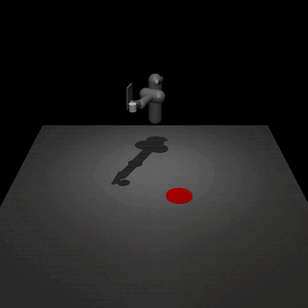

__Table of Contents:__
- [Inspiration](#inspiration)
- [Development Tools](#development-tools)
- [Env](#env)
  - [Observation Space](#observation-space)
  - [Action Space](#action-space)
  - [Reward](#reward)
  - [Vectorized Environment](#vectorized-environment)
- [Learning Paradigm](#learning-paradigm)
  - [RL](#rl)
  - [Deep RL](#deep-rl)
  - [Policy Gradient Methods](#policy-gradient-methods)
  - [Proximal Policy Optimization](#proximal-policy-optimization)
  - [Curriculum Learning](#curriculum-learning)
- [Results](#results)
- [Solution Analysis](#solution-analysis)
- [Dev Challenges](#dev-challenges)
- [Further Considerations](#further)
  - [Vision Control](#vision-control)
  - [Automatic Curriculum Learning](#automatic-curriculum-learning)
  - [Parallel Multitask RL](#parallel-multitask-rl)
  - [Sim to Real](#sim-to-real)
  
## Inspiration
This work is inspired by _[TossingBot: Learning to Throw Arbitrary Objects with Residual Physics (Princeton University, Google, Columbia University, MIT.)](https://tossingbot.cs.princeton.edu/)_ (below).

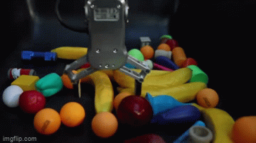

In order to make the task a little easier from the exploration point of view, we replaced the fingers with a plate. In this setting the robot need to learn to throw an object using just a flat surface.
## Development Tools

 1. Mujoco
 2. Gymansium-Robotics
 3. StableBaselines3

<!-- This work was developed as a course project of Smart Robotics, University of Modena and Reggio Emilia, Italy

<a href="https://www.canva.com/design/DAFspXKsex4/6PJ41YdfBPMxjuhkqJpZkw/view?utm_content=DAFspXKsex4&utm_campaign=designshare&utm_medium=link&utm_source=publishsharelink">:bar_chart: Here the slides of # the presentation :bar_chart:</a>

 -->

## Env

### Observation Space

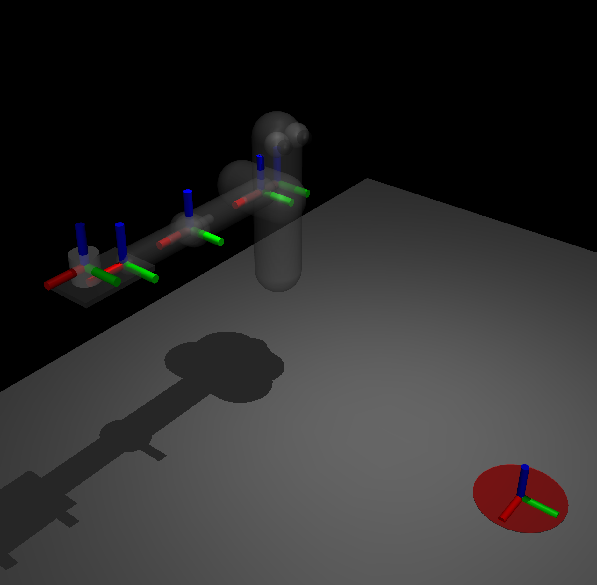

There are 19 observations:

+ Shoulder rotation (rad)
+ Elbow rotation  (rad)
+ Wrist rotation (rad)
+ Shoulder angular velocity (rad/s)
+ Elbow angular velocity (rad/)
+ Wrist angular velocity (rad/s)
+ Wrist coordinate (m)
+ Object coordinate (m)
+ Goal coordinate (m)

__Observation range:__ [-inf, inf]

### Action Space

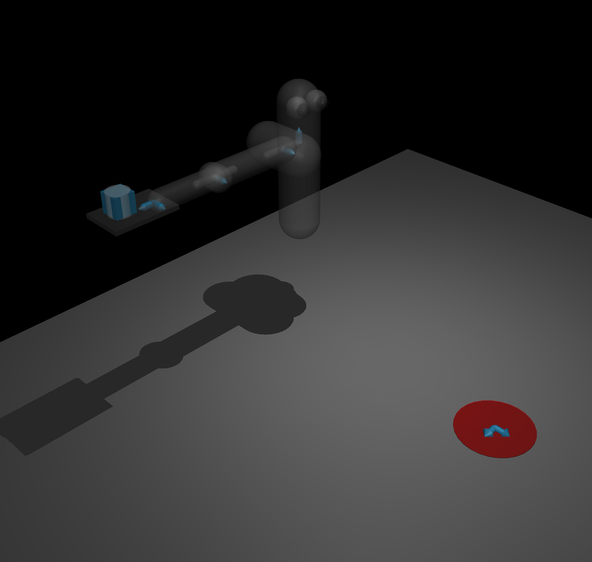

__Actions:__
+ Shoulder joint 2 DoF
+ Elbow joint 1 DoF
+ Wrist joint  2 DoF

__Control range:__ [-2, 2] (N·m)

### Reward

$Reward = -||obj\\_pos - target\\_pos|| - 0.1 * ||action||^2 $

The first term force the learning process to focus on throwing the object effectively. The second term force the learning process to develop an efficient motion of the robotic arm. The 0.1 weight scales down the second term in order to delay the learning process of the efficient motion only after being able to solve the main task.

### Vectorized Environment

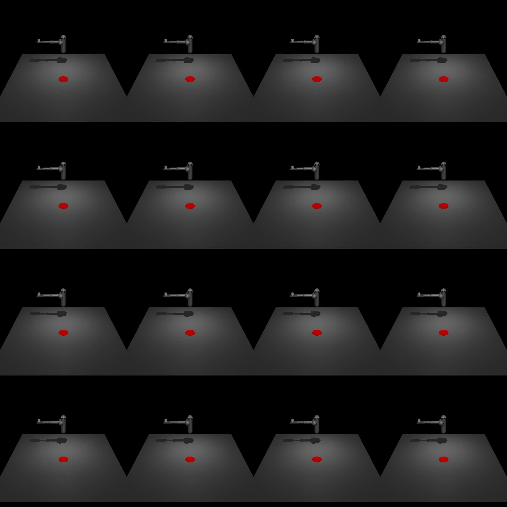

Allows multiple instances of the same environment to run in parallel which leds to a more efficient utilization of computing resources. 
This settings enhance exploration, as the agent can explore different parts of the state space simultaneously. Every instance has its own separate state.

We used 16 parallel envs during the training.

## Learning Paradigm
### RL

It is the third paradigm of Machine Learning. In this setting the agent learns to take actions by exploring the environment, observes outcomes, and adjust its strategy (policy) to maximize total rewards.

### Deep RL

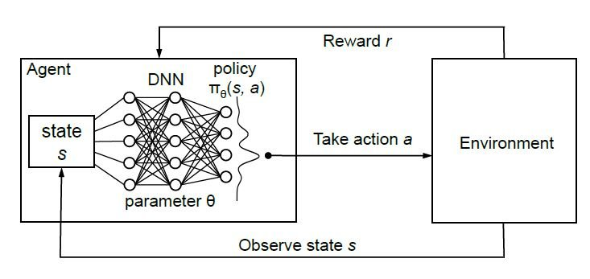

Specific approach within RL that uses deep neural networks to approximate complex decision-making functions i.e. handle high-dimensional and intricate state and action spaces.

### Policy Gradient Methods
This methods aim to directly learns a policy to solve the given task.

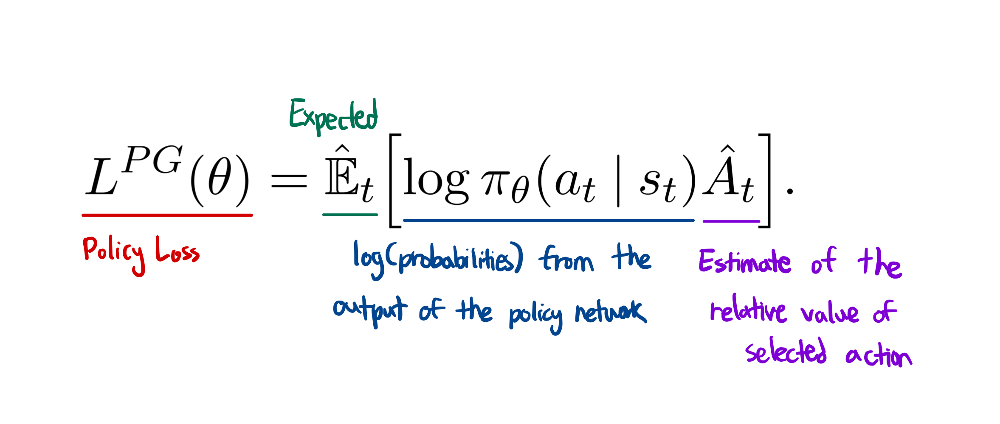

where:
+ $A_t$ is called 'Advantage' and is defined as $A_t = G_t - V_t$
+ $G_t$ is the return i.e. the discounted sum of rewards in a single episode
+ $V_t$ is the value function i.e. the estimation of $G_t$ done at time $t$

### Proximal Policy Optimization (PPO)
The Policy Gradient Methods is calculated online i.e. the policy is optimized on an observation history sampled by the policy itself. This leads to major instabilities in the learning process which sometimes brings the policy to diverge by focusing on a constantly shifting distribution. When it happens, the agent is not working towards the main goal anymore and thus stops to learn. To solve this issue OpenAI engineered the PPO.
Basically, the new policy gradient method force the agent to learn a "proximal" policy which is a policy not too different from the one in the previous episode. The plots below, shows how they are clipping the loss in order to avoid extreme changes on the main strategy.

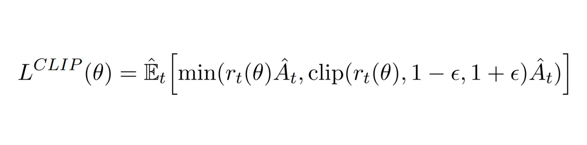

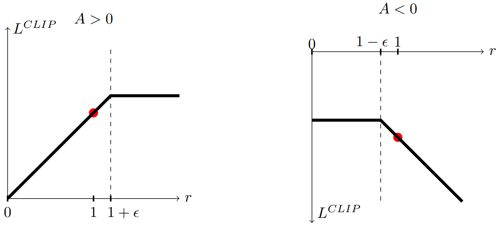

### Curriculum Learning

The curriculum learning is the concept of decomposing a complex task in simpler handcrafted subtasks in order to effectively reach the overall goal.

We investigated this approach in order to teach the agent to both throw the object and also track the target.
Indeed the fist curriculum task was to learn the throwing motion to a static target. Instead the next two curriculums tasks focused on gradually increase the spawn offset of the target.

We trained the agent for 12M steps over each task.

## Results

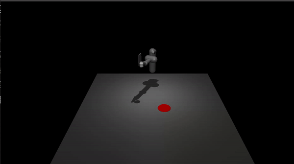

We realized that in order to solve the task, the agent learned to "slap" the object. It resambles the behavior of the human hand in a volleyball match.

## Solution Analysis
+ Not requires any explicit model of the kinematics, neither direct nor inverse. __This big plus when dealing with very complex dexterous robots__.
+ Not requires any model of the dynamics, neither direct nor inverse.
+ No explicit control model.
+ Not requires multiple control models for different interactions patterns (like interaction and interaction free tasks). Just one comprehensive control.
+ Online adaptation to variations (e.g. The mathematical model of electric actuations will change with time).
+ Scalable fast training on complex tasks thanks to vectorized envs.
+ Reduce entry level skills of the operator.
+ Short time to deploy.
  
## Dev Challenges
+ Broken video recorder lib of GPU parallel virtualized environment.
+ Bad documentation of the Mujoco Lib
+ Bad documentation of the StableBaseline3 regarding curriculum.
+ Different base env class between tasks. Very library dependent. It makes hard the integration of a custom pipeline.

## Further
This section describes some considerations we made to further improve the flexibility and the effectiveness of this learning approach.

### Vision Control
We realized that introducing a vision control feedback, this solution could be adopted more easily in a real enviroment.

+ __End-to-End Traning:__ The observations are entextracted by a Neural Network instead of retreiving them from the simulator API.

### Automatic Curriculum Learning (ACL)

The ACL is a process that identify automatically the correct sequential task used to train the agent, instead of defining them by hand.

### Parallel Multitask RL

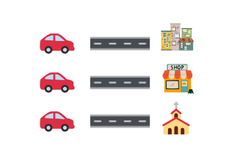

The Parallel Multitask RL is a training pattern where multiple pretext tasks are trained togheter in order to share useful knowledge for the main task. It is similar to ACL(above) but the tasks are solved in parallel and not sequentially.

### Sim to Real

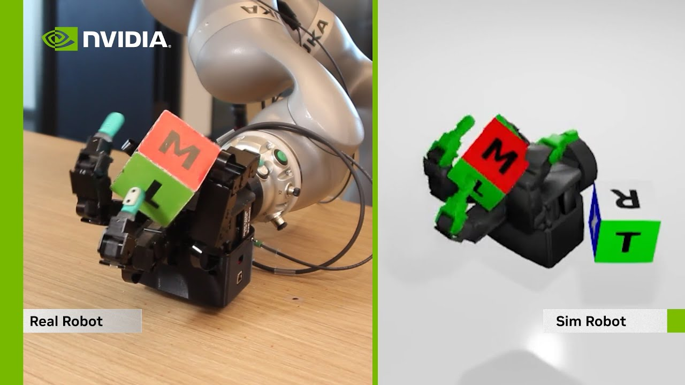

Honorable mention to _[DeXtreme: Transfer of Agile In-Hand Manipulation from Simulation to Reality](https://dextreme.org/)_ a work made by NVIDIA. This works proves that is possible to go from simulation to reality effictively even on a complex task like robotic hand dexterity.
