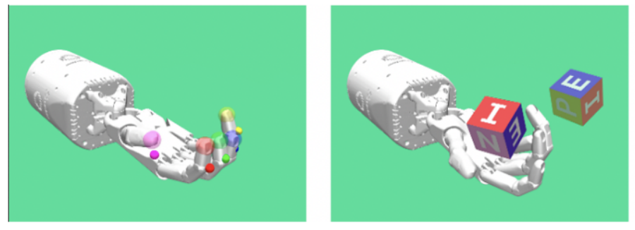

# Object Toss with a Robotic Arm

__Table of Contents:__
- [Inspiration](#inspiration)
- [Development Tools](#development-tools)
- [Env](#env)
  - [Observation Space](#observation-space)
  - [Action Space](#action-space)
  - [Reward](#reward)
  - [Vectorized Environment](#vectorized-environment)
- [Learning Paradigm](#learning-paradigm)
  - [RL](#rl)
  - [Deep RL](#deep-rl)
  - [Policy Gradient Methods](#policy_gradient_methods)
  - [Proximal Policy Optimization](#proximal-policy-optimization)
  - [Curriculum Learning](#curriculum-learning)
- [Results](#results)
- [Solution Analysis](#solution-analysis)
- [Dev Challenges](#dev-challenges)
- [Further Considerations](#further)
  - [Vision Control](#vision-control)
  - [Automatic Curriculum Learning](#automatic-curriculum-learning)
  - [Parallel Multitask RL](#parallel-multitask-rl)
  - [Sim to Real](#sim-to-real)
  
## Inspiration

## Development Tools

 1. Mujoco
 2. Gymansium-Robotics
 3. StableBaselines3

<!-- This work was developed as a course project of Smart Robotics, University of Modena and Reggio Emilia, Italy

<a href="https://www.canva.com/design/DAFspXKsex4/6PJ41YdfBPMxjuhkqJpZkw/view?utm_content=DAFspXKsex4&utm_campaign=designshare&utm_medium=link&utm_source=publishsharelink">:bar_chart: Here the slides of # the presentation :bar_chart:</a>

 -->

## Env

### Observation Space

### Action Space

### Reward
### Vectorized Environment

Allows multiple instances of the same environment to run in parallel which leds to a more efficient utilization of computing resources. 
This settings enhance exploration, as the agent can explore different parts of the state space simultaneously. Every instance has its own separate state.

## Learning Paradigm
### RL

### Deep RL

### Policy Gradient Methods

### Proximal Policy Optimization

### Curriculum Learning

## Results

## Solution Analysis
+ Not requires any explicit model of the kinematics, neither direct nor inverse. __This big plus when dealing with very complex dexterous robots__.
+ Not requires any model of the dynamics, neither direct nor inverse.
+ No explicit control model.
+ Not requires multiple control models for different interactions patterns (like interaction and interaction free tasks). Just one comprehensive control.
+ Online adaptation to variations (e.g. The mathematical model of electric actuations will change with time).
+ Scalable fast training on complex tasks thanks to vectorized envs.
+ Reduce entry level skills of the operator.
+ Short time to deploy.
  
## Dev Challenges
+ Broken video recorder lib of GPU parallel virtualized environment.
+ Bad documentation of the Mujoco Lib
+ Bad documentation of the StableBaseline3 regarding curriculum.
+ Different base env class between tasks. Very library dependent. It makes hard the integration of a custom pipeline.

## Further
### Vision Control
### Automatic Curriculum Learning

### Parallel Multitask RL

### Sim to Real

